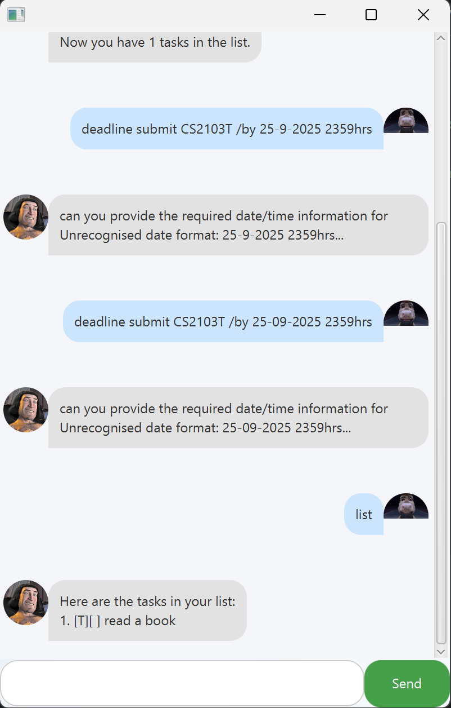

# Farquaad User Guide

  

---

## Introduction

Welcome to **Farquaad**, your friendly task manager chatbot with a modern GUI.  
Farquaad helps you keep track of **todos, deadlines, and events**. It even reminds you of **upcoming tasks within 3 days**.

This guide explains how to use Farquaad’s key features with examples.  
All commands are typed into the input box at the bottom, then press **Enter** or click **Send**.

---

## Quick Start

1. Download the latest `.jar` file from **Releases**.
2. Open a terminal, navigate to the folder with the file, and run:  
   `java -jar farquaad.jar`

3. The GUI will open. Start typing commands!

---

## Adding Todos

Adds a simple task without any date or time.

**Example:**
``` todo read book ```


**Expected Output:**
``` 
Got it. I've added this task:
[T][ ] read book
Now you have 1 task in the list.
```

---

## Adding Deadlines

Adds a task that must be done **before a specific date**.

**Example:**
```deadline submit report /by 2025-09-25```

**Expected Output:**
```
Got it. I've added this task:
[D][ ] submit report (by: 25 Sep 2025)
Now you have 2 tasks in the list.
```

---

## Adding Events

Adds a task that happens **within a time period**.

**Example:**
`event project meeting /from 2025-09-23 1000 /to 2025-09-23 1200`

**Expected Output:**
````
Got it. I've added this task:
[E][ ] project meeting (from: Sep 23 2025, 10:00 AM to: Sep 23 2025, 12:00 PM)
Now you have 3 tasks in the list.
````

---

## Listing All Tasks

Shows all tasks currently in your list.

**Example:**
`list`


**Expected Output:**
````
Here are the tasks in your list:

[T][ ] read book

[D][ ] submit report (by: 25 Sep 2025)

[E][ ] project meeting (from: Sep 23 2025, 10:00 AM to: Sep 23 2025, 12:00 PM)
````

---

## Marking Tasks as Done

Marks a task in the list as completed.

**Example:**
`mark 1`


**Expected Output:**
````
Nice! I've marked this task as done:
[T][X] read book
````

---

## Unmarking Tasks

Marks a completed task back to **not done**.

**Example:**
`unmark 1`

**Expected Output:**
````
OK, I've marked this task as not done yet:
[T][ ] read book
````

---

## Deleting Tasks

Deletes a task from the list.

**Example:**
`delete 2`

**Expected Output:**
````
Noted. I've removed this task:
[D][ ] submit report (by: 25 Sep 2025)
Now you have 2 tasks in the list.
````

---

## Finding Tasks

Searches for tasks containing a specific keyword.

**Example:**
`find book`

**Expected Output:**
````
These are the matching tasks in your list:

[T][ ] read book
````

---

## Reminders

Farquaad will remind you about deadlines due in the next **3 days**:
- Automatically on startup.
- On-demand using the `remind` command.

**Example:**
`remind`

**Expected Output:**
````
Here are your upcoming deadlines (next 3 days):

[D][ ] submit report (by: 25 Sep 2025)
````
---

## Exiting Farquaad

Closes the application.

**Example:**
`bye`

**Expected Output:**
````
Bye. Hope to see you again soon!
````

---

## Command Summary

| Action          | Format                                | Example                                  |
|-----------------|---------------------------------------|------------------------------------------|
| Add todo        | `todo DESCRIPTION`                    | `todo read book`                         |
| Add deadline    | `deadline DESCRIPTION /by DATE`       | `deadline submit report /by 2025-09-25` |
| Add event       | `event DESCRIPTION /from START /to END` | `event meeting /from 2025-09-23 1000 /to 2025-09-23 1200` |
| List tasks      | `list`                                | `list`                                   |
| Mark task       | `mark INDEX`                          | `mark 1`                                 |
| Unmark task     | `unmark INDEX`                        | `unmark 1`                               |
| Delete task     | `delete INDEX`                        | `delete 2`                               |
| Find task       | `find KEYWORD`                        | `find book`                              |
| Remind tasks    | `remind`                              | `remind`                                 |
| Exit program    | `bye`                                 | `bye`                               
